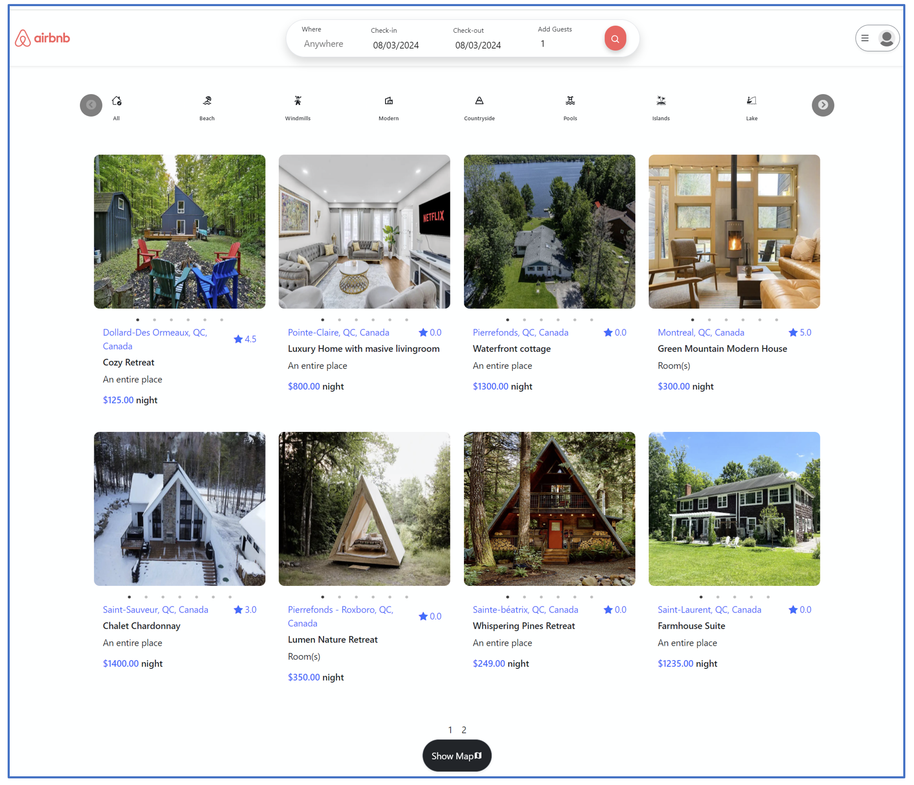

# Vacation Rental Platform Clone

## Overview

This project is an educational clone inspired by Airbnb, designed to replicate the platform’s design and functionality. It serves as a learning exercise, showcasing the implementation of a full-stack web application and emphasizing best practices in software development and deployment.

## 

## Technologies Used

- **Frontend**: React.js
- **Backend**: Node.js, Express
- **Database Management**: MongoDB
- **Image File Management**: AWS S3
- **CI/CD Pipelines**: AWS EC2, Jenkins, SonarQube, Docker

## Features

- User authentication and authorization
- Property listing creation and management
- Advanced search and filtering for listings
- Booking functionality with availability checks
- Review system for rating and reviewing properties
